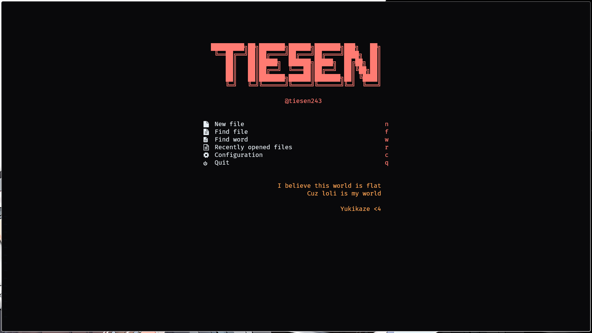

# My Neovim Config



**Requiment**

1. Install nerd-font at [here](https://www.nerdfonts.com/font-downloads) and set it as your terminal font (I use FiraCode Nerd Font)
2. Install fzf, fd, ripgrep

**Try my config**

> Windows

```bash
git clone git@github.com:tiesen243/nvim.git $env:LOCALAPPDATA\nvim
```

> Linux

```bash
git clone git@github.com:tiesen243/nvim.git ~/.config/nvim
```

**Note**

1. The default `<leader>` shortcut is `<space>` (you can change it in `settings.lua`)
