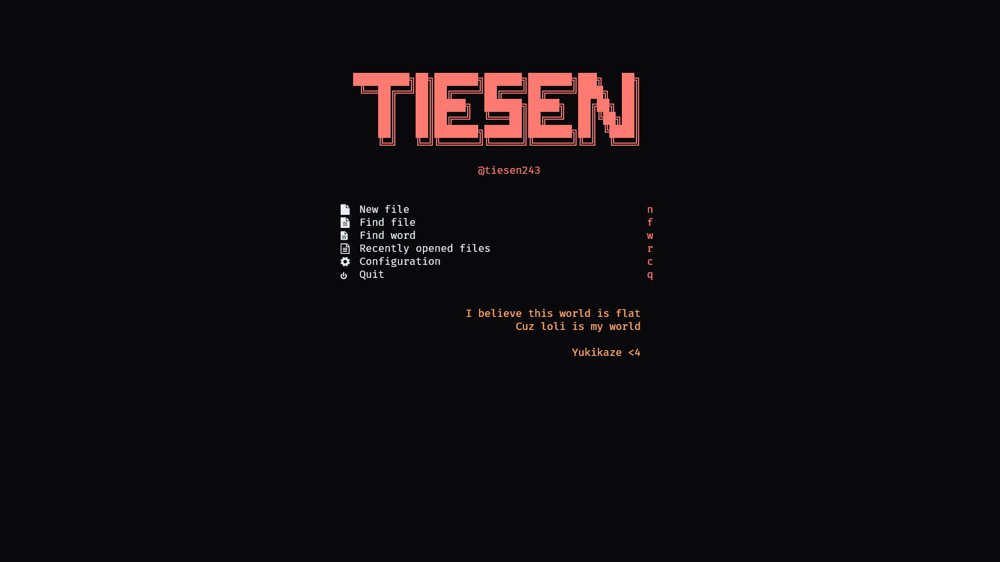

# My Neovim Config



## Features

1. **LSP** (Language Server Protocol) support
2. **CMP** for autocompletion
3. **Copilot** for code suggestion
4. **Mason** for lsp management
5. **TreeSitter** for syntax highlighting
6. **Telescope** for fuzzy finding
7. **Bufferline** for buffer management
8. **Lualine** for status line
9. **NvimTree** for file explorer
10. **Auto-pairs** for auto closing brackets
11. **Comment** for commenting code
12. **Mini-Indent** for auto indent code
13. **Gitsigns** for git status
14. **Colorizer** for color highlighting
15. **Alpha** for startup screen
16. **Noice** for floating ui

## Requirements

1. Install nerd-font at [here](https://www.nerdfonts.com/font-downloads) and set it as your terminal font (I use FiraCode Nerd Font)
2. Install fzf, fd, ripgrep

```bash
# Ubuntu
sudo apt install fzf fd-find ripgrep

# Arch
sudo pacman -S fzf fd ripgrep

# MacOS
brew install fzf fd ripgrep

# Windows (with scoop)
scoop install fzf fd ripgrep
```

## Installation

> Windows

```bash
git clone git@github.com:tiesen243/nvim.git $env:LOCALAPPDATA\nvim
```

> Linux

```bash
git clone git@github.com:tiesen243/nvim.git ~/.config/nvim
```

**Note**

1. The default `<leader>` shortcut is `<space>` (you can change it in `lua/core/lazy.lua`)

## License

This project is licensed under the MIT License - see the [LICENSE](LICENSE.md) file for details
